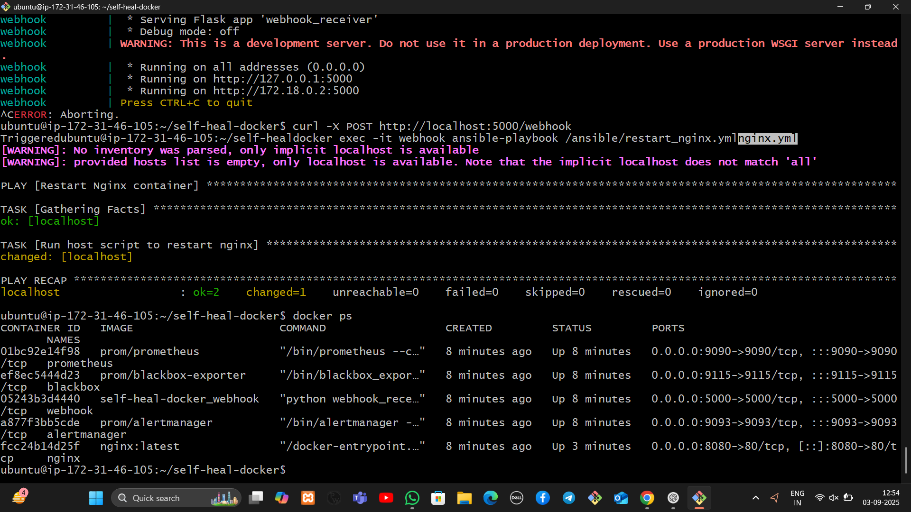
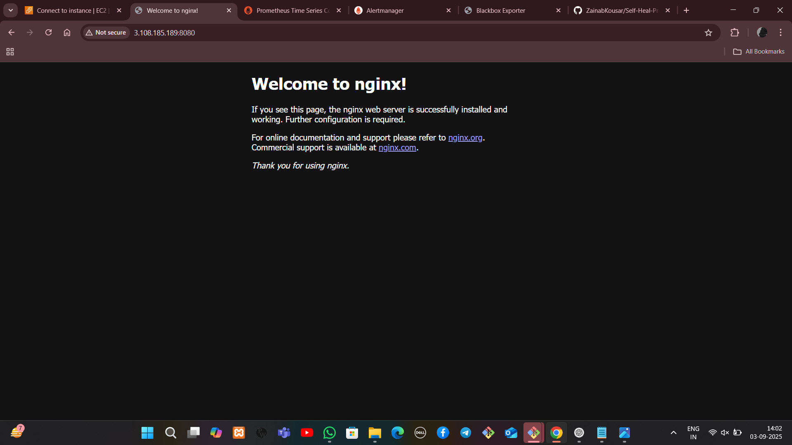
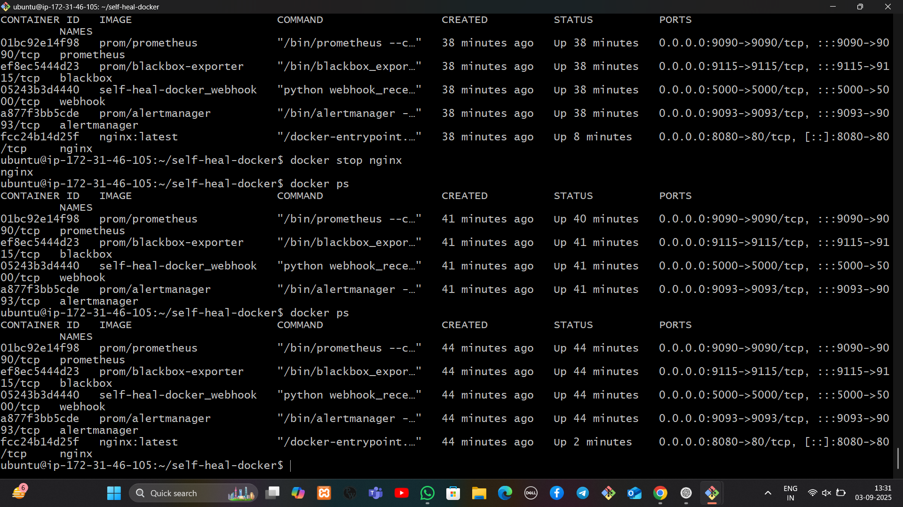
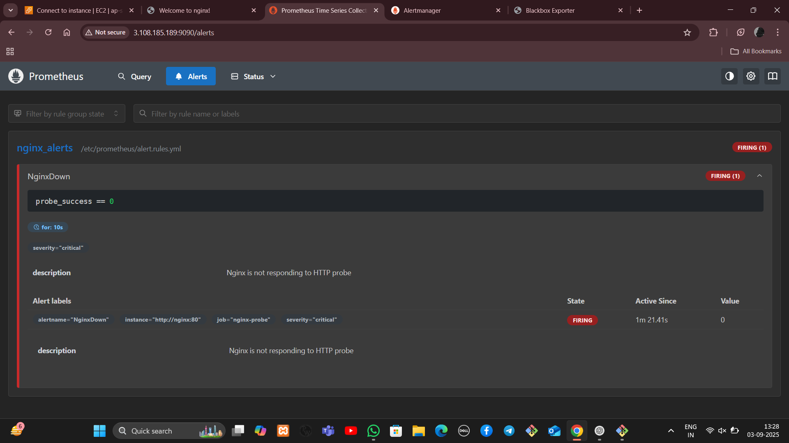
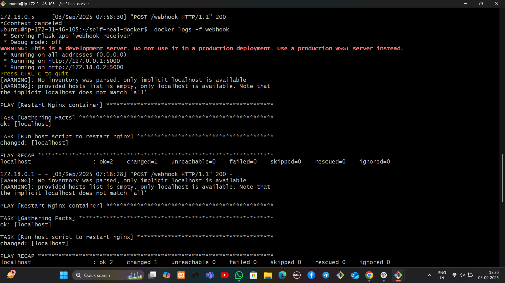

Self-Healing Nginx Project 🚀

Hey there! 👋 Welcome to my Self-Healing Nginx project. If you’ve ever wanted to see how monitoring, alerting, and automation can work together to keep your service alive without manual intervention, you’re in the right place.

This project is all about making Nginx resilient using a few powerful tools: Prometheus, Alertmanager, a Python webhook, and Ansible. When something goes wrong, the system heals itself automatically. No more panicking when your server goes down! 😎

Why I Built This

Sometimes services crash or go down, and manual intervention is slow and error-prone.
I wanted to combine monitoring, alerting, and automation to make a setup that:

Detects failures in real-time ✅

Sends alerts automatically ✅

Fixes the issue without anyone touching the server ✅

Basically, it’s like having your own IT superhero that never sleeps. 🦸‍♀️

Tech Stack

Here’s what makes this magic happen:

Tool	Purpose
Docker	Run all services in isolated containers
Nginx	The service we are monitoring
Prometheus	Monitors Nginx and other targets
Alertmanager	Receives alerts from Prometheus and forwards them
Webhook (Flask)	Receives alerts and triggers automation
Ansible	Restarts Nginx automatically when an alert is received
How It Works

Prometheus keeps an eye on Nginx every few seconds.

If Nginx goes down, Prometheus fires an alert.

Alertmanager receives the alert and sends it to the webhook.

The webhook runs an Ansible playbook to restart Nginx.

Nginx is back online, all automatically! ⚡

Setup & Run

Clone this repo:

git clone https://github.com/<your-username>/self-heal-docker.git
cd self-heal-docker

Start everything using Docker Compose:

docker-compose up -d

Check all containers are running:

docker ps

Tail the webhook logs to see automation in action:

docker logs -f webhook

(Optional) Stop Nginx to test self-healing:

docker stop nginx

You’ll see the webhook triggered automatically, and Nginx restarts within seconds

Next Steps / Improvements

Add email or Slack notifications from Alertmanager

Extend to monitor multiple services

Add custom health checks using Prometheus exporters

This project is a great demo of modern DevOps practices: monitoring, alerting, and automation all working together. It’s like building your own self-healing server. 💪

Feel free to explore, test, and improve it!

## **Screenshots**

### Docker containers running

### Nginx web page

### Nginx up after restart

### Prometheus Alerts

### Alertmanager UI

### Webhook Logs

